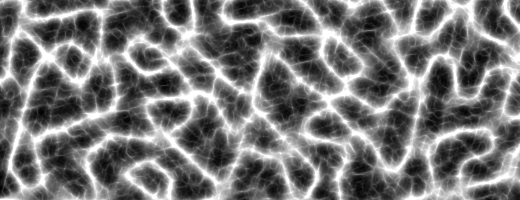

# 非整数ブラウン運動

ノイズという言葉は人によって違う物事を意味します。ミュージシャンであれば雑音のことを、コミュニケーションを仕事にする人であれば余計な干渉のことを、天体物理学者であれば宇宙マイクロ波背景放射のことを考えるでしょう。これらの概念は、世の中のランダムな現象の背後にある物理的な原因について考えさせてくれます。でも、まずはもっと根本的でシンプルなことから始めましょう。波とその特性についてです。波とは時間の上で起こる、ある特性を持った振動です。音波とは空気圧における振動、電磁波は電界、磁界における振動です。

波の2つ重要な性質に振幅（amplitude）と周波数（frequency）があります。単純な一次元の波を表す式はこのようになります。

<div class="simpleFunction" data="
float amplitude = 1.;
float frequency = 1.;
y = amplitude * sin(x * frequency);
"></div>

* 波の性質について理解を深めるため、振幅と周波数の値を変えてみましょう。

* シェイピング関数を使って振幅を時間とともに変化させてみましょう。

* シェイピング関数を使って周波数を時間とともに変化させてみましょう。

2番目と3番目の演習をすることであなたはサイン波を「モデュレート」させて、AM波（amplitude modulated）とFM波（frequency modulated）を作り出したことになります。

波の興味深い特性の1つに、重ね合わせができるということがあります。下記のコードをコメントアウトしたり数値を変えたりしてみましょう（訳注： ```y +=``` で始まる行で試してください）。

<div class="simpleFunction" data="
float amplitude = 1.;
float frequency = 1.;
y = sin(x * frequency);
float t = 0.01 * (-u_time*130.0);
y += sin(x*frequency*2.1 + t) * 4.5;
y += sin(x*frequency*1.72 + t * 1.121) * 4.0;
y += sin(x*frequency*2.221 + t * 0.437) * 5.0;
y += sin(x*frequency*3.1122+ t * 4.269) * 2.5;
y *= amplitude* 0.06;
"></div>

* 重ね合わされている波の振幅や周波数を変えて実験してみましょう。

* 2つの波を互いに打ち消し合わせることはできますか。どのように見えるでしょう。

* 2つの波を、お互いを強め合うように重ね合わせることはできますか。

音楽では、それぞれの音程は特定の周波数に対応しています。これら音程の周波数は音階と呼ばれるパターンに従って並べられ、1オクターブごとに2倍または半分になります。

さて、サイン波の代わりにパーリンノイズを使ってみましょう。パーリンノイズの基本的な形状はサイン波（訳注：サイン波を重ね合わせたもの）に似た見た目をしています。振幅と周波数はいくらか変化しますが、振幅は比較的安定しており、周波数の変化はある値を中央値とした狭い範囲に制限されています。一方でパーリンノイズはサイン波ほど規則正しくはありません。幾つかのスケールを変えたノイズを重ね合わせればより不規則な見た目を作り出すのも簡単です。サイン波を重ね合わせたものをランダムに見せることも可能ですが、周期的で規則正しい性質を隠すにはたくさんの異なる波を重ねる必要があります。

周波数を一定の割合で増加させる（lacunarity）と同時に振幅を減らしながら（gain）ノイズを（octaveの数だけ）繰り返し重ねることで、より粒度の細かいディテールを持ったノイズを作り出すことができます。このテクニックは「非整数ブラウン運動（fBM）」または単に「フラクタルノイズ」と呼ばれていて、最も単純な形は下記のコードのようになります。

<div class="simpleFunction" data="// Properties
const int octaves = 1;
float lacunarity = 2.0;
float gain = 0.5;
//
// Initial values
float amplitude = 0.5;
float frequency = 1.;
//
// Loop of octaves
for (int i = 0; i < octaves; i++) {
&#9;y += amplitude * noise(frequency*x);
&#9;frequency *= lacunarity;
&#9;amplitude *= gain;
}"></div>

* 1から2、4、8、10と ```octave``` の値を徐々に変化させて何が起きるか観察してみましょう。

* ```octave``` の値が4より大きい状態で ```lacunarity``` の値を変化させてみましょう。

* 同じく ```octave``` の値が4より大きい状態で ```gain``` の値を変化させてみましょう。

```octave``` を増やすと曲線のディテールがより細かくなることに注目してください。また、その際の自己相似性にも注意しましょう。曲線を拡大しても、細かな部分の形が全体の形と同じになっているように見えます。また、拡大した部分は多かれ少なかれ他の部分と似ています。これは数学的なフラクタルの重要な性質で、私たちはこの性質をループの中でシミュレートしているのです。ここではシミュレーションは数回の繰り返しの後で打ち切られているので本当の意味でのフラクタルを作り出しているわけではありません。しかし理論上では、ループを永遠に繰り返して無限にノイズを重ね合わせれば、本当に数学的なフラクタルを得ることができるでしょう。コンピュータグラフィクスでは常に処理できる細かさに限界があります。例えばピクセルより小さなものは見えないので、フラクタルな見た目を作り出すのに無限回の足し算を行う必要はありません。たくさんの繰り返しが必要になることはあるかもしれませんが、無限回になることは決してありません。

下記のコードは2次元のfBMを実装してフラクタル状の模様を作り出した例です。

<div class='codeAndCanvas' data='2d-fbm.frag'></div>

* 37行目の ```octave``` を減らしてみましょう。

* 47行目の ```lacunarity``` を変化させてみましょう。

* 48行目の ```gain``` を変えて試してみましょう。

このテクニックはプログラムで地形を作り出すのによく用いられています。fBMの自己相似性は、山を形づくる侵食過程の自己相似性に似ているため、山脈の形を再現するのに最適です。もし興味があればInigo Quilesによる[高度なノイズ](http://www.iquilezles.org/www/articles/morenoise/morenoise.htm)についての素晴らしい記事を読むと良いでしょう。


同様のテクニックを使って「乱流（turbulence）」と呼ばれる効果を作り出すこともできます。基本的にはfBMなのですが、鋭い谷間を作り出すために符号付きノイズ（signed noise）の絶対値を用いています。

```glsl
for (int i = 0; i < OCTAVES; i++) {
    value += amplitude * abs(snoise(st));
    st *= 2.;
    amplitude *= .5;
}
```

<a href="../edit.php#13/turbulence.frag"></img></a>

同じ仲間のアルゴリズムに「尾根（ridge）」があります。深い谷が上下逆さまにされて鋭い尾根を作り出しています。

```glsl
    n = abs(n);     // create creases
    n = offset - n; // invert so creases are at top
    n = n * n;      // sharpen creases
```

<a href="../edit.php#13/ridge.frag"></img></a>

他の便利な仲間には、ノイズを足し算する代わりに掛け合わせたものがあります。ノイズ関数をそれまでのループの結果に応じてスケールさせても面白いでしょう。こうすると厳密なフラクタルから離れて、より謎めいた「マルチフラクタル」の世界に足を踏み入れることになります。マルチフラクタルはフラクタルほどは数学的に厳密に定義されていませんが、だからと言って役に立たないというわけではありません（訳注：厳密に定義されてないというより、より一般化された概念なのでもっといろんなものを含んじゃうよ、という感じだと思います）。実際にマルチフラクタルシミュレーションは地形生成に用いる現代の商用ソフトで一般的に用いられています。より深く知りたければKenton Musgraveによる「[Texturing and Modeling: a Procedural Approach (3rd edition)](https://www.amazon.co.jp/Texturing-Modeling-Third-Procedural-Approach/dp/1558608486)」を読むと良いでしょう。残念なことにこの本は数年前に絶版になってしまいましたが、図書館や中古で見つけることができるでしょう（第1版のPDF版はオンラインで手に入りますが買わないように。お金の無駄です。1994年に出版されたもので、第3版に載っている地形生成についての部分は含まれていません）。

### ドメインワーピング

Inigo Quilesはこの[興味をそそる記事](http://www.iquilezles.org/www/articles/warp/warp.htm)でfBMを使ってfBMの空間を歪める方法について書いています。ぶっ飛んでますね。インセプションに出てくる夢の中の夢のようです。


下記はこのテクニックのもう少しおとなしいサンプルです。空間の歪みが雲のようなテクスチャを作り出すのに使われています。ここでもまた自己相似性が見られることに注目してください。

<div class='codeAndCanvas' data='clouds.frag'></div>

このようにテクスチャ座標を歪める技はとても便利で、楽しく、しかし非道なほどマスターするのが難しいものです。とても強力なツールですが使いこなすにはかなりの経験が必要です。便利なテクニックとしてノイズの微分（勾配）を用いて座標をずらす方法があります。Ken PerlinとFabrice Neyretによる「[flow noise](http://evasion.imag.fr/Publications/2001/PN01/) 」という記事はこのアイデアに基づくものです。最近のパーリンノイズの実装の幾つかは、その関数の値と解析的な勾配の両方を計算してくれます。もしある関数について本物の勾配が得られない場合でも常に、手間がかかり正確さに劣りますが、差分法を用いて近似することができます。

（訳注：要するにノイズの値そのものではなくその微分を使うという話です。微分が直接計算できない場合は微妙にずらした2点の値を計算して差分をとることで近似することができます。この辺りはもう少し説明が必要ですね。参考になるかわかりませんがこの[サンプル](https://thebookofshaders.com/edit.php?log=161119153749)では ```normal``` 関数の中で少し座標をずらしてノイズの値を計算して比較することで傾きを計算しています。）
