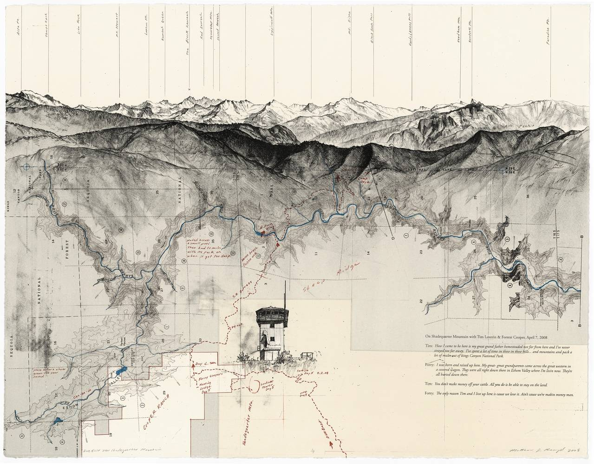
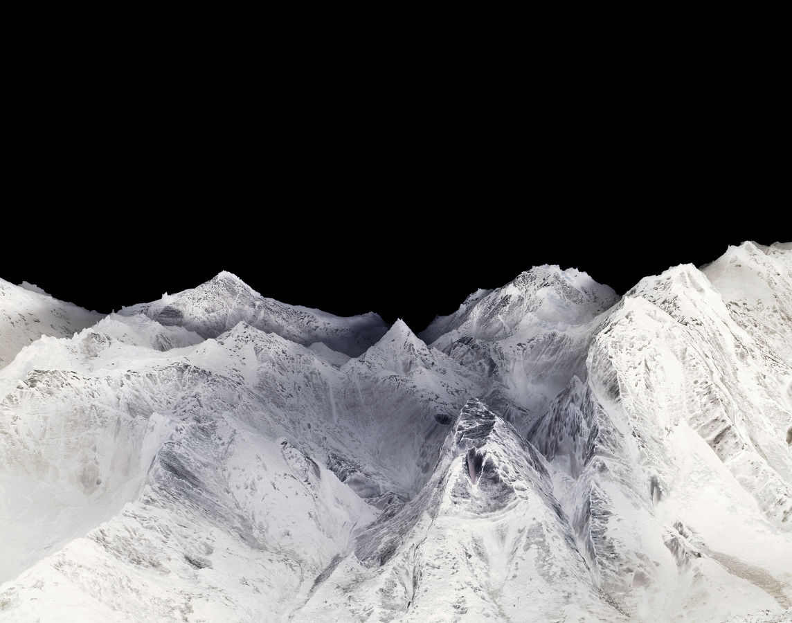
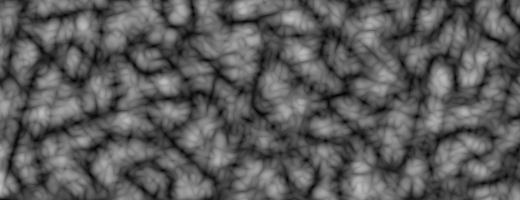
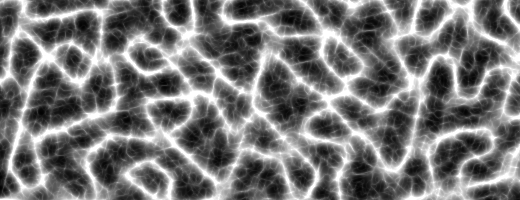
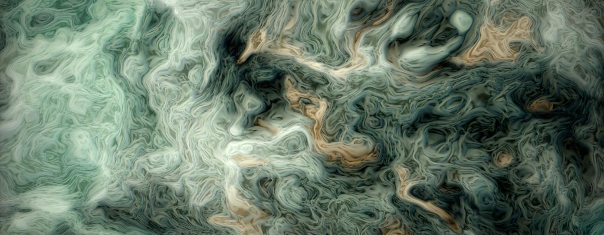

## Fractal Brownian Motion

Noise tends to mean different things to different people. Musicians will think of it in terms of disturbing sounds, communicators as interference and astrophysicists as cosmic microwave background radiation. These concepts bring us back to the physical reasons behind randomness in the world around us. However, let's start with something more fundamental, and more simple: waves and their properties. A wave is a fluctuation over time of some property. Audio waves are fluctuations in air pressure, electromagnetical waves are fluctuations in electrical and magnetic fields. Two important characteristics of a wave are its amplitude and frequency. The equation for a simple linear (one-dimensional) wave looks like this:

<div class="simpleFunction" data="
float amplitude = 1.;
float frequency = 1.;
y = amplitude * sin(x * frequency);
"></div>

* Try changing the values of the frequency and amplitude to understand how they behave.
* Using shaping functions, try changing the amplitude over time.
* Using shaping functions, try changing the frequency over time.

By doing the last two exercises you have managed to "modulate" a sine wave, and you just created AM (amplitude modulated) and FM (frequency modulated) waves. Congratulations!

Another interesting property of waves is their ability to add up, which is formally called superposition. Comment/uncomment and tweak the following lines. Pay attention to how the overall appearance changes as we add waves of different amplitudes and frequencies together.

<div class="simpleFunction" data="
float amplitude = 1.;
float frequency = 1.;
y = sin(x * frequency);
float t = 0.01*(-u_time*130.0);
y += sin(x*frequency*2.1 + t)*4.5;
y += sin(x*frequency*1.72 + t*1.121)*4.0;
y += sin(x*frequency*2.221 + t*0.437)*5.0;
y += sin(x*frequency*3.1122+ t*4.269)*2.5;
y *= amplitude*0.06;
"></div>

* Experiment by changing the frequency and amplitude for the additional waves.
* Is it possible to make two waves cancel each other out? What will that look like?
* Is it possible to add waves in such a way that they will amplify each other?

In music, each note is associated with a specific frequency. The frequencies for these notes follow a pattern which we call a scale, where a doubling or halving of the frequency corresponds to a jump of one octave.

Now, let's use Perlin noise instead of a sine wave! Perlin noise in its basic form has the same general look and feel as a sine wave. Its amplitude and frequency vary somewhat, but the amplitude remains reasonably consistent, and the frequency is restricted to a fairly narrow range around a center frequency. It's not as regular as a sine wave, though, and it's easier to create an appearance of randomness by summing up several scaled versions of noise. It is possible to make a sum of sine waves appear random as well, but it takes many different waves to hide their periodic, regular nature.

By adding different iterations of noise (*octaves*), where we successively increment the frequencies in regular steps (*lacunarity*) and decrease the amplitude (*gain*) of the **noise** we can obtain a finer granularity in the noise and get more fine detail. This technique is called "fractal Brownian Motion" (*fBM*), or simply "fractal noise", and in its simplest form it can be created by the following code:

<div class="simpleFunction" data="// Properties
const int octaves = 1;
float lacunarity = 2.0;
float gain = 0.5;
//
// Initial values
float amplitude = 0.5;
float frequency = 1.;
//
// Loop of octaves
for (int i = 0; i < octaves; i++) {
&#9;y += amplitude * noise(frequency*x);
&#9;frequency *= lacunarity;
&#9;amplitude *= gain;
}"></div>

* Progressively change the number of octaves to iterate from 1 to 2, 4, 8 and 10. See what happens.
* When you have more than 4 octaves, try changing the lacunarity value.
* Also with >4 octaves, change the gain value and see what happens.

Note how with each additional octave, the curve seems to get more detail. Also note the self-similarity while more octaves are added. If you zoom in on the curve, a smaller part looks about the same as the whole thing, and each section looks more or less the same as any other section. This is an important property of mathematical fractals, and we are simulating that property in our loop. We are not creating a *true* fractal, because we stop the summation after a few iterations, but theoretically speaking, we would get a true mathematical fractal if we allowed the loop to continue forever and add an infinite number of noise components. In computer graphics, we always have a limit to the smallest details we can resolve, for example when objects become smaller than a pixel, so there is no need to make infinite sums to create the appearance of a fractal. A lot of terms may be needed sometimes, but never an infinite number.

The following code is an example of how fBm could be implemented in two dimensions to create a fractal-looking pattern:

<div class='codeAndCanvas' data='2d-fbm.frag'></div>

* Reduce the number of octaves by changing the value on line 37
* Modify the lacunarity of the fBm on line 47
* Explore by changing the gain on line 48

This technique is commonly used to construct procedural landscapes. The self-similarity of the fBm is perfect for mountains, because the erosion processes that create mountains work in a manner that yields this kind of self-similarity across a large range of scales. If you are interested in this use, you should definitely read [this great article by Inigo Quiles about advanced noise](http://www.iquilezles.org/www/articles/morenoise/morenoise.htm).



Using more or less the same technique, it's also possible to obtain other effects like what is known as **turbulence**. It's essentially an fBm, but constructed from the absolute value of a signed noise to create sharp valleys in the function.

```glsl
for (int i = 0; i < OCTAVES; i++) {
    value += amplitude * abs(snoise(st));
    st *= 2.;
    amplitude *= .5;
}
```

<a href="../edit.php#13/turbulence.frag"></img></a>

Another member of this family of algorithms is the **ridge**, where the sharp valleys are turned upside down to create sharp ridges instead:

```glsl
    n = abs(n);     // create creases
    n = offset - n; // invert so creases are at top
    n = n * n;      // sharpen creases
```

<a href="../edit.php#13/ridge.frag"></img></a>

Another variant which can create useful variations is to multiply the noise components together instead of adding them. It's also interesting to scale subsequent noise functions with something that depends on the previous terms in the loop. When we do things like that, we are moving away from the strict definition of a fractal and into the relatively unknown field of "multifractals". Multifractals are not as strictly defined mathematically, but that doesn't make them less useful for graphics. In fact, multifractal simulations are very common in modern commercial software for terrain generation. For further reading, you could read chapter 16 of the book "Texturing and Modeling: a Procedural Approach" (3rd edition), by Kenton Musgrave. Sadly, that book is out of print since a few years back, but you can still find it in libraries and on the second hand market. (There's a PDF version of the 1st edition available for purchase online, but don't buy that - it's a waste of money. It's from 1994, and it doesn't contain any of the terrain modeling stuff from the 3rd edition.)

### Domain Warping

[Inigo Quiles wrote this other fascinating article](http://www.iquilezles.org/www/articles/warp/warp.htm) about how it's possible to use fBm to warp a space of a fBm. Mind blowing, Right? It's like the dream inside the dream of Inception.



A less extreme example of this technique is the following code where the wrap is used to produce this clouds-like texture. Note how the self-similarity property is still present in the result.

<div class='codeAndCanvas' data='clouds.frag'></div>

Warping the texture coordinates with noise in this manner can be very useful, a lot of fun, and fiendishly difficult to master. It's a powerful tool, but it takes quite a bit of experience to use it well. A useful tool for this is to displace the coordinates with the derivative (gradient) of the noise. [A famous article by Ken Perlin and Fabrice Neyret called "flow noise"](http://evasion.imag.fr/Publications/2001/PN01/) is based on this idea. Some modern implementations of Perlin noise include a variant that computes both the function and its analytical gradient. If the "true" gradient is not available for a procedural function, you can always compute finite differences to approximate it, although this is less accurate and involves more work.

#### For your toolbox

* [LYGIA's generative functions ](https://lygia.xyz/generative) are a set of reusable functions to generate patterns in GLSL. It's a great resource to learn how to use randomness and noise to create generative art. It's very granular library, designed for reusability, performance and flexibility. And it can be easily be added to any projects and frameworks.