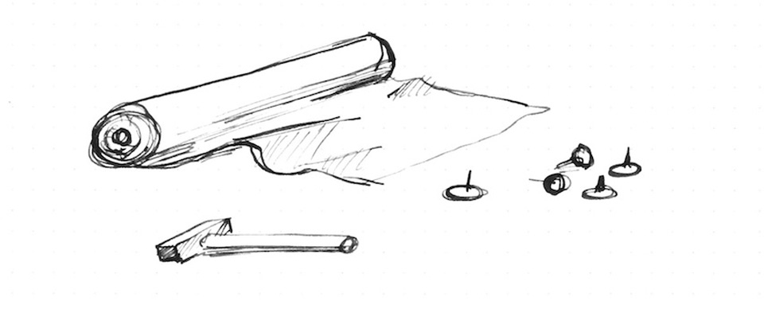

# 图像处理

## 纹理



显卡（GPU）有特殊的图像存储类型。在中央处理器（CPU）上，图像往往储存成字节数组，但在GPU上图像却往往储存成```sampler2D``` （二维采样器）。它们更像是一个由浮点向量组成的表格（或矩阵）。更有意思的是，这张*表格*中向量们的值是连续的。这意味着邻近像素点的值之间是用较低级别的插值出来的。

为了用到这一特性，我们首先要把图像从CPU*上传*到GPU，然后再把纹理的```id```（序列号）传给对应的[```uniform```](../05)。这一切流程发生在着色器之外。

一旦纹理（texture）加载好了并且链接上了一个有效的```uniform sampler2D```，你就可以用[```texture2D()```](index.html#texture2D.md)函数获取特定坐标（用二维向量[```vec2```](index.html#vec2.md)类型表示）对应的颜色值（用四维向量[```vec4```](index.html#vec4.md)类型表示）。

```glsl
vec4 texture2D(sampler2D texture, vec2 coordinates)  
```

在下面的代码中，我们将《神奈川冲浪里》（1830）以```uniform sampler2D u_tex0```为类型和名字加载了进来，并且我们在显示平面（billboard）中调用了它的每个像素：

<div class="codeAndCanvas" data="texture.frag" data-textures="hokusai.jpg"></div>

如果你注意观察，你会发现纹理的坐标是归一化的！这真的是个惊喜，不是吗？纹理坐标和我们已然熟识的东西是一致的。它们的坐标总是在0.0和1.0之间。这意味着它和我们使用的归一化空间坐标完美吻合。

现在既然你已经了解了如何正确的加载纹理，是时候来试验性地探索我们究竟能用这一技巧做些什么了。快试试下面这些：

* 把纹理缩小到原先的一半。
* 把原先的纹理旋转90度。
* 将鼠标位置赋值给纹理坐标来移动纹理。

为什么你要为纹理痴狂呢？首先请忘了通道那可悲的255值吧；一旦你的图像被转换成了一个```uniform sampler2D```，所有的值都会在0.0和1.0的区间范围内（小数精度取决于你把```precision```设置成了多少）。这就是着色器能创造出美轮美奂的后处理效果的原因。

其次，[```vec2()```](index.html#vec2.md)类型意味着你甚至可以获取到像素之间的值。如前所述，纹理是连续体（continuum）。也就是说，如果正确地设置好了你的纹理，你可以获取纹理图像上的任意值，而这些值在像素点之间是平滑过渡的！

最后，你可以让你的图像在边缘处重复。这样的话，在你获取坐标超出0.0到1.0这个归一化区间的值时，返回值会从另一边的边缘开始循环往复。

所有这些功能会让你的图像越发像是无限循环往复的化纤面料。你可以拉扯、伸缩你的纹理而无需注意它们原初的数据究竟是什么样的。要体验这一点，看看下面的代码吧，其中我们使用[我们先前创建的噪声函数](../11/)来扭曲纹理。

<div class="codeAndCanvas" data="texture-noise.frag" data-textures="hokusai.jpg"></div>

## 纹理分辨率

上述的种种示例仅展现了长宽相等的方形图像匹配方形显示平面（billboard）的情形。而至于非正方形图像，事情就没那么简单了。不幸的是，几个世纪以来的绘画艺术和摄影艺术发现非正方形比例的图像更令人赏心悦目。


我们该如何解决这个问题呢？我们需要知道这一图像的原始比例，才好在放大或缩小纹理的时候正确地保持它原始的[*宽高比*](http://en.wikipedia.org/wiki/Aspect_ratio)。为此，纹理的宽和高是以```uniform```的形式传递进着色器的——在我们的示例框架里是以纹理名后跟```Resolution```的```uniform vec2```传递进来的。一旦着色器里有了这些信息，我们就可以将纹理分辨率的```宽度```除以```高度```来获得纹理的宽高比。最后，把这个比例和```y```坐标相乘，我们就可以实现伸缩这根轴来让纹理匹配其原始比例。

取消 21 行的注释来实操一下吧。

<div class="codeAndCanvas" data="texture-resolution.frag" data-textures="nicephore.jpg"></div>

* 如果要这张图片居中显示，我们应该怎么做呢？

## 数字装潢（Digital upholstery）


你可能会觉得这有些不必要地繁琐……呃，可能你是对的。但这种对待图像的方式给了“奇技淫巧”足够的发挥空间。试想，你是一名室内装潢师，通过拉伸和折叠织物结构，你可以创造出更好的新图案和新技巧。


这种水平的工艺可以追溯到最早的一些光学实验。例如，游戏里很常见的*精灵动画*（*sprite animations*），你不可避免地会在它身上看到费纳奇镜（phenakistoscope）、西洋镜（zoetrope）和改良版西洋镜（praxinoscope）的影子。

这看起来很简单，但修改纹理坐标可以带来巨大的可能性。例如：

<div class="codeAndCanvas" data="texture-sprite.frag" data-textures="muybridge.jpg"></div>

现在轮到你了:

* 你能活学活用，做出万花筒效果吗？

* 在Oculus和谷歌Cardboard之前，立体摄影是件大事。你能编写一个简单的着色器来重新使用这些美丽的图像吗?

<a href=“../edit.php#10/ikeda-03.frag”><canvas id=“custom” class=“canvas” data-fragment-url=“ikeda-03.frag”  width=“520px” height=“200px”></canvas></a>


* 你还可以使用纹理来再创造哪些其他的光学玩具吗?

在下一章中，我们将学习如何使用着色器进行一些图像处理。你会注意到着色器的复杂性最终是有意义的，因为它很大程度上是为这一过程而生的。我们将开始做一些图像操作!
