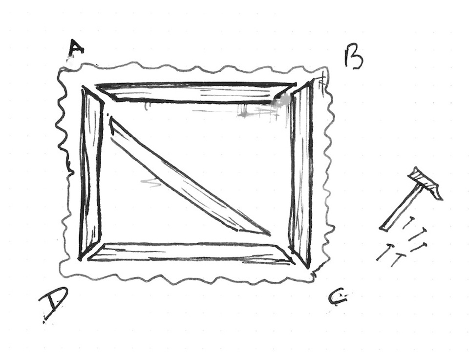
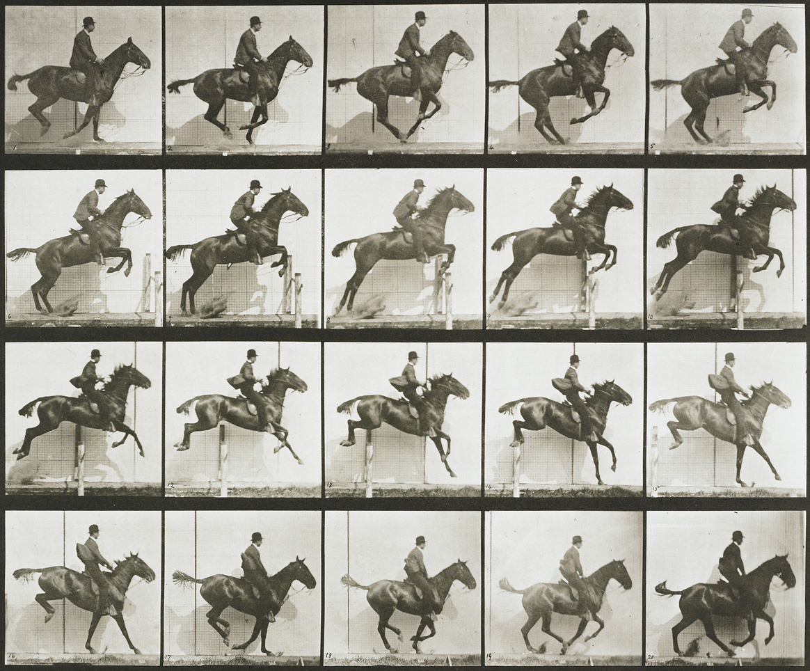

# Processamento de imagens

## Texturas


Placas gráficas (GPUs) têm tipos especiais de memórias para imagens. Geralmente, nas CPUs as imagens são armazenadas como arrays de bytes, mas as GPUs armazenam as imagens como ```sampler2D```, o que é mais como uma tabela (ou matriz) de vetores de ponto flutuante. Mais interessante ainda, os valores dessa  *tabela* de vetores são contínuos. Isso quer dizer que os valores entre os pixels são interpolados em baixo nível.

Para usar essa característica, primeiro precisamos fazer um *upload* da imagem da CPU para a GPU, para então passar o```id``` da textura para o [```uniform```](../05) correto. Tudo isso acontece fora do shader.

Uma vez que a textura esteja carregada e linkada a um ```uniform sampler2D``` válido, você pode solicitar valores específicos de cores em coordenadas específicas (formatadas em uma variiável [```vec2```](index.html#vec2.md)) usanto a função [```texture2D()```](index.html#texture2D.md) que vai retornar uma cor formatada em uma variável [```vec4```](index.html#vec4.md).

```glsl
vec4 texture2D(sampler2D texture, vec2 coordinates)  
```

Verifique o seguinte código onde carregamos a Onda de Hokusai (1830) como um ```uniform sampler2D u_tex0``` e chamamos cada pixel dela dentro da tela:

<div class="codeAndCanvas" data="texture.frag" data-textures="hokusai.jpg"></div>

Se você prestar atenção, vai notar que as coordenadas da textura estão normalizadas! Que surpresa, certo? As coordenadas das texturas são consistentes com o resto das coisas que já vimos e suas coordenadas estão entre 0.0 e 1.0, o que combina perfeitamente com o espaço normalizado de coordenadas que temos usado. 

Agora que você já viu como carregamos uma textura de forma correta, é hora de fazer experiências, para descobrir o que podemos fazer com isso, tentando:

* Escalar a textura anterior, pela metade.
* Rotacionar a textura anterior em 90 graus.
* Ligar a posição do mouse às coordenadas, e movê-la.

Por que você deveria estar anomado com as texturas? Bem, antes de tudo, esqueça os 255 valores tristes para o canal, uma vez que sua imagem esteja transformada em um ```uniform sampler2D``` você terá todos os valores entre 0.0 e 1.0 (dependendo do que você setar na ```precision```). É  por isso que as os shaders podem fazer efeitos realmente lindos pós-processament.

Em segundo lugar, o [```vec2()```](index.html#vec2.md) significa que você pode pegar os valores entre os pixels. Como dizemos antes, as texturas são um continuum. Isso quer dizer que se você configurar sua textura corretamente, você pode pedir valores em torno de toda a superfície de sua imagem, e os valores vão variar suavemente de pixel a pixel, sem pulos!

Por fim, você pode setar sua imagem para repetir nas bordas, então você pode dar valores além ou menores que os normalizados 0.0 e 1.0, os valores vão dar a volta e recomeçar.

Todas essas características fazem suas imagens mais como uma fábrica infinita. Você pode esticar e encolher sua textura sem notar a grade de bytes de que elas são compostas originalmente, ou o fim dela. Para experimentar isso, dê uma olhada no seguinte código, onde nós distorcemos uma textura usando a [função de ruído que já fizemos](../11/).

<div class="codeAndCanvas" data="texture-noise.frag" data-textures="hokusai.jpg"></div>

## Texture resolution

Above examples play well with squared images, where both sides are equal and match our squared billboard. But for non-squared images things can be a little more tricky, and unfortunately centuries of pictorial art and photography found more pleasant to the eye non-squared proportions for images.


How we can solve this problem? Well we need to know the original proportions of the image to know how to stretch the texture correctly in order to have the original [*aspect ratio*](http://en.wikipedia.org/wiki/Aspect_ratio). For that the texture width and height are passed to the shader as an ```uniform```, which in our example framework are passed as an ```uniform vec2``` with the same name of the texture followed with proposition ```Resolution```. Once we have this information on the shader we can get the aspect ratio by dividing the ```width``` for the ```height``` of the texture resolution. Finally by multiplying this ratio to the coordinates on ```y``` we will shrink this axis to match the original proportions.

Uncomment line 21 of the following code to see this in action.

<div class="codeAndCanvas" data="texture-resolution.frag" data-textures="nicephore.jpg"></div>

* What we need to do to center this image?

## Digital upholstery



You may be thinking that this is unnecessarily complicated... and you are probably right. Also this way of working with images leaves enough room to different hacks and creative tricks. Try to imagine that you are an upholster and by stretching and folding a fabric over a structure you can create better and new patterns and techniques.



This level of craftsmanship links back to some of the first optical experiments ever made. For example on games *sprite animations* are very common, and is inevitably to see on it reminiscence to phenakistoscope, zoetrope and praxinoscope.

This could seem simple but the possibilities of modifying textures coordinates are enormous. For example:

<div class="codeAndCanvas" data="texture-sprite.frag" data-textures="muybridge.jpg"></div>

Now is your turn:

* Can you make a kaleidoscope using what we have learned?

* Way before Oculus or google cardboard, stereoscopic photography was a big thing. Could you code a simple shader to re-use these beautiful images?

<a href=“../edit.php#10/ikeda-03.frag”><canvas id=“custom” class=“canvas” data-fragment-url=“ikeda-03.frag”  width=“520px” height=“200px”></canvas></a>


* What other optical toys can you re-create using textures?

In the next chapters we will learn how to do some image processing using shaders. You will note that finally the complexity of shader makes sense, because it was in a big sense designed to do this type of process. We will start doing some image operations!
