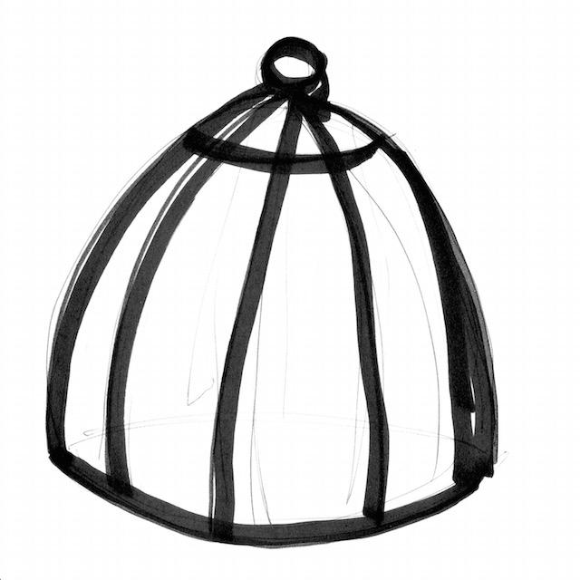
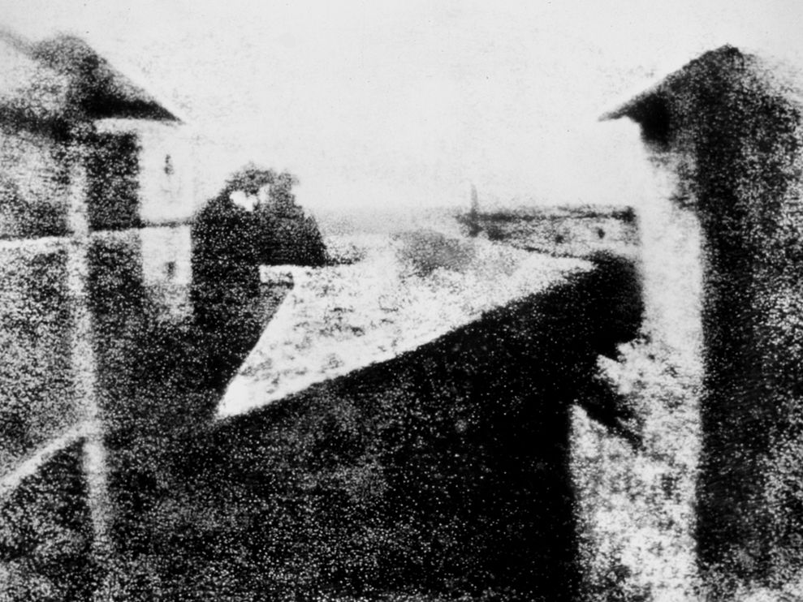
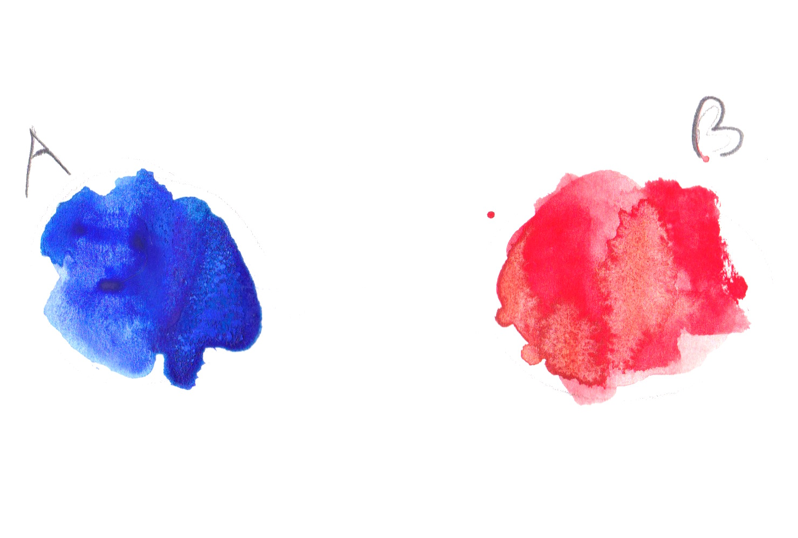
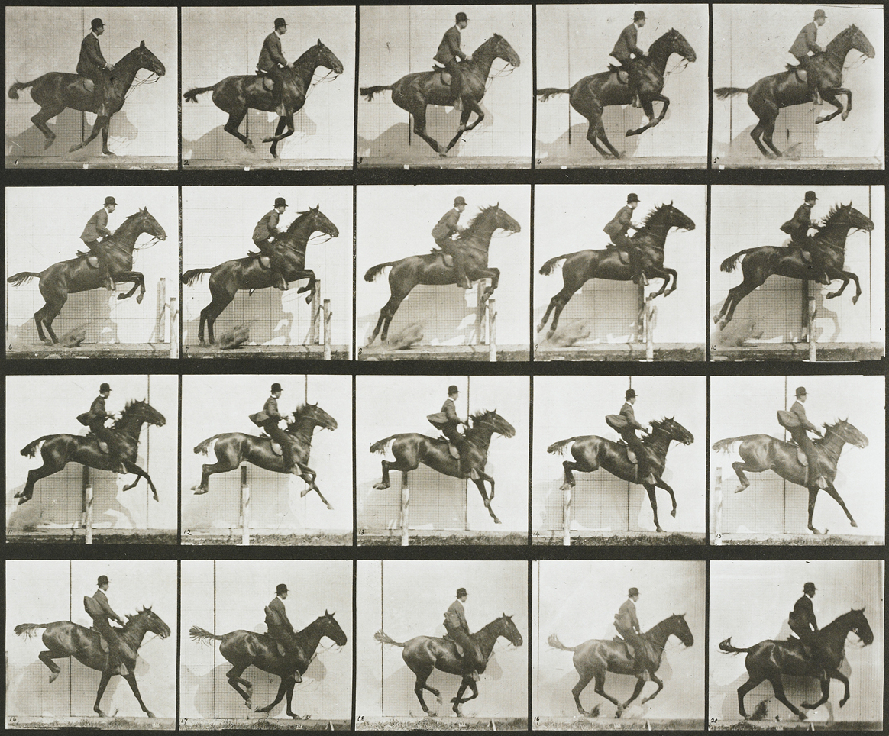
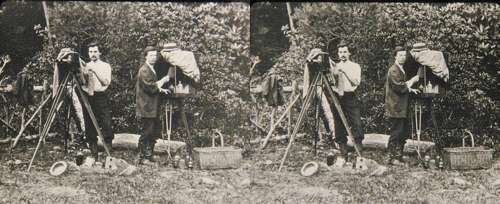

# Image processing

## Textures



Graphic cards (GPUs) have special memory types for images. Usually on CPUs images are stored as arrays of bytes but GPUs store images as ```sampler2D``` which is more like a table (or matrix) of floating point vectors. More interestingly, the values of this *table* of vectors are continuous. That means that values between pixels are interpolated in a low level.

In order to use this feature we first need to *upload* the image from the CPU to the GPU, to then pass the ```id``` of the texture to the right [```uniform```](../05). All that happens outside the shader.

Once the texture is loaded and linked to a valid ```uniform sampler2D``` you can ask for specific color value at specific coordinates (formatted on a [```vec2```](index.html#vec2.md) variable) using the [```texture2D()```](index.html#texture2D.md) function which will return a color formatted on a [```vec4```](index.html#vec4.md) variable.

```glsl
vec4 texture2D(sampler2D texture, vec2 coordinates)  
```

Check the following code where we load Hokusai's Wave (1830) as ```uniform sampler2D u_tex0``` and we call every pixel of it inside the billboard:

<div class="codeAndCanvas" data="texture.frag" data-textures="hokusai.jpg"></div>

If you pay attention you will note that the coordinates for the texture are normalized! What a surprise right? Textures coordinates are consistent with the rest of the things we had seen and their coordinates are between 0.0 and 1.0 which match perfectly with the normalized space coordinates we have been using.

Now that you have seen how we correctly load a texture, it is time to experiment to discover what we can do with it, by trying:

* Scaling the previous texture by half.
* Rotating the previous texture 90 degrees.
* Hooking the mouse position to the coordinates to move it.

Why you should be excited about textures? Well first of all forget about the sad 255 values for channel; once your image is transformed into a ```uniform sampler2D``` you have all the values between 0.0 and 1.0 (depending on what you set the ```precision``` to ). That's why shaders can make really beautiful post-processing effects.

Second, the [```vec2()```](index.html#vec2.md) means you can get values even between pixels. As we said before the textures are a continuum. This means that if you set up your texture correctly you can ask for values all around the surface of your image and the values will smoothly vary from pixel to pixel with no jumps!

Finally, you can set up your image to repeat in the edges, so if you give values over or lower of the normalized 0.0 and 1.0, the values will wrap around starting over.

All these features make your images more like an infinite spandex fabric. You can stretch and shrink your texture without noticing the grid of bytes they are originally composed of or the ends of it. To experience this take a look at the following code where we distort a texture using [the noise function we already made](../11/).

<div class="codeAndCanvas" data="texture-noise.frag" data-textures="hokusai.jpg"></div>

## Texture resolution

Above examples play well with squared images, where both sides are equal and match our squared billboard. But for non-squared images things can be a little more tricky, and unfortunately centuries of pictorial art and photography found more pleasant to the eye non-squared proportions for images.



How we can solve this problem? Well we need to know the original proportions of the image to know how to stretch the texture correctly in order to have the original [*aspect ratio*](http://en.wikipedia.org/wiki/Aspect_ratio). For that the texture width and height are passed to the shader as an ```uniform```, which in our example framework are passed as an ```uniform vec2``` with the same name of the texture followed with proposition ```Resolution```. Once we have this information on the shader we can get the aspect ratio by dividing the ```width``` for the ```height``` of the texture resolution. Finally by multiplying this ratio to the coordinates on ```y``` we will shrink this axis to match the original proportions.

Uncomment line 21 of the following code to see this in action.

<div class="codeAndCanvas" data="texture-resolution.frag" data-textures="nicephore.jpg"></div>

* What we need to do to center this image?

## Digital upholstery



You may be thinking that this is unnecessarily complicated... and you are probably right. Also this way of working with images leaves enough room to different hacks and creative tricks. Try to imagine that you are an upholster and by stretching and folding a fabric over a structure you can create better and new patterns and techniques.



This level of craftsmanship links back to some of the first optical experiments ever made. For example on games *sprite animations* are very common, and is inevitably to see on it reminiscence to [phenakistoscope](https://en.wikipedia.org/wiki/Phenakistiscope), [zoetrope](https://en.wikipedia.org/wiki/Zoetrope) and [praxinoscope](https://en.wikipedia.org/wiki/Praxinoscope).

This could seem simple but the possibilities of modifying textures coordinates are enormous. For example:

<div class="codeAndCanvas" data="texture-sprite.frag" data-textures="muybridge.jpg"></div>

Now is your turn:

* Can you make a kaleidoscope using what we have learned?

<canvas id="custom" class="canvas" data-fragment-url="texture-kaleidoscope.frag" data-textures="hokusai.jpg" width="300px" height="300px"></canvas>

* Way before [Oculus](https://en.wikipedia.org/wiki/Oculus_Rift) or [google cardboard](https://en.wikipedia.org/wiki/Google_Cardboard), stereoscopic photography was a big thing. Could you code a simple shader to re-use these beautiful images?




* What other optical toys can you re-create using textures?

In the next chapters we will learn how to do some image processing using shaders. You will note that finally the complexity of shader makes sense, because it was in a big sense designed to do this type of process. We will start doing some image operations!
