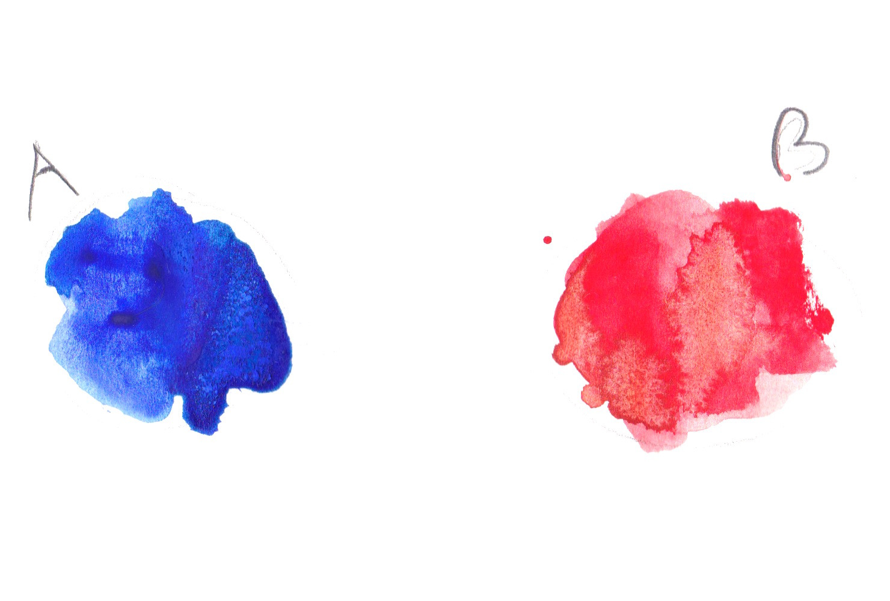

## Image operations

Below you will see some examples with images where you can play around and uncomment some lines to see the corresponding results.

### Invert

### Add, Substract, Multiply and others

### PS Blending modes

